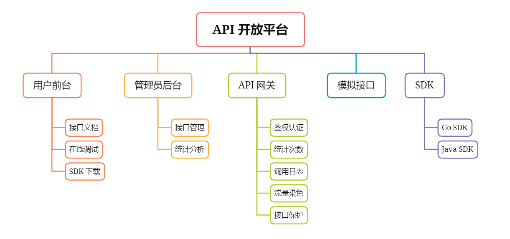
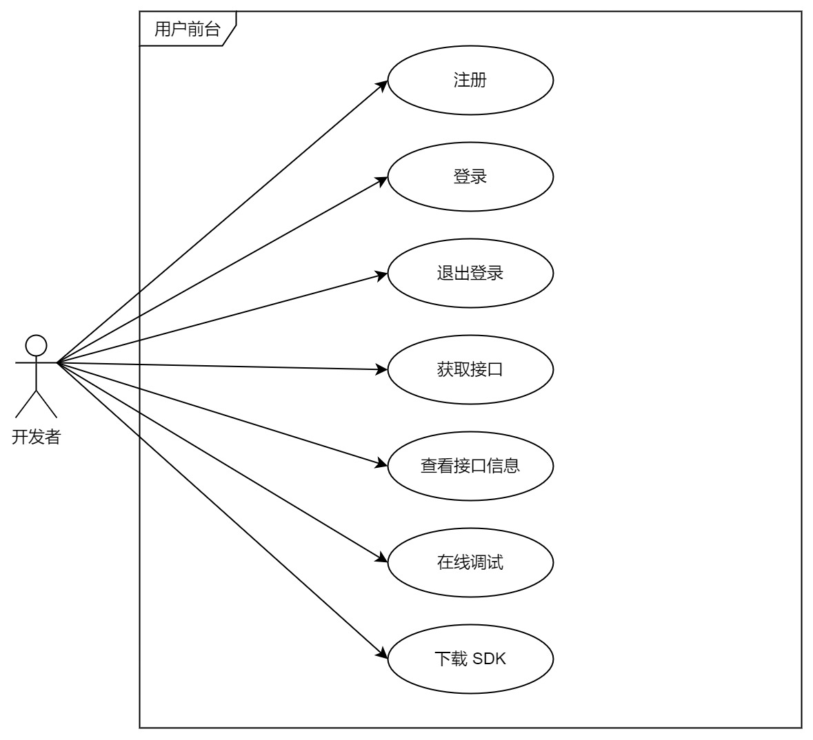
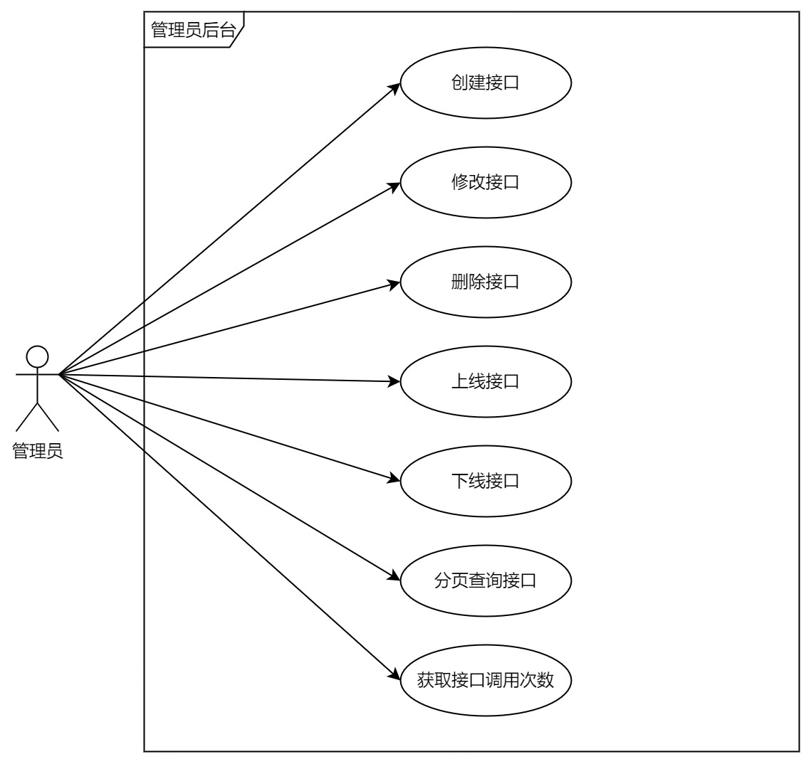
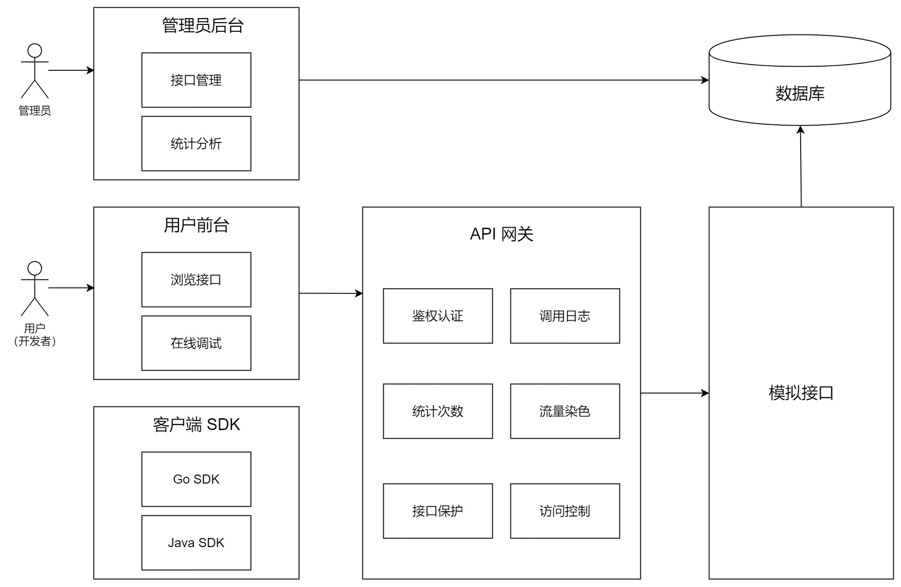
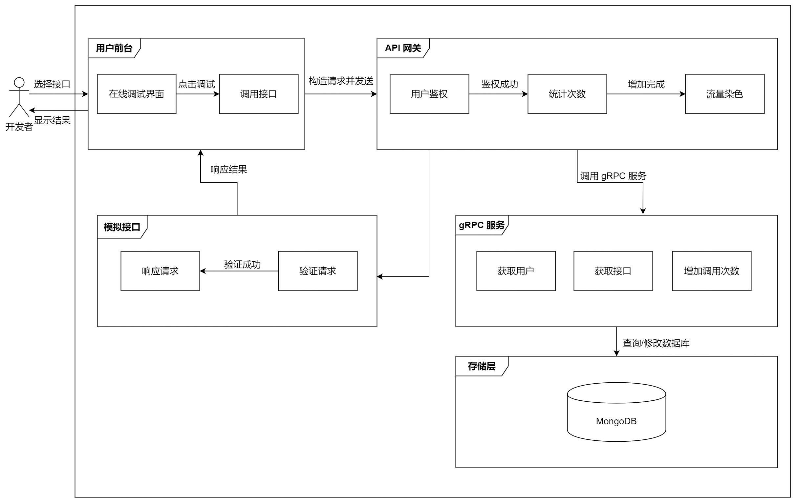
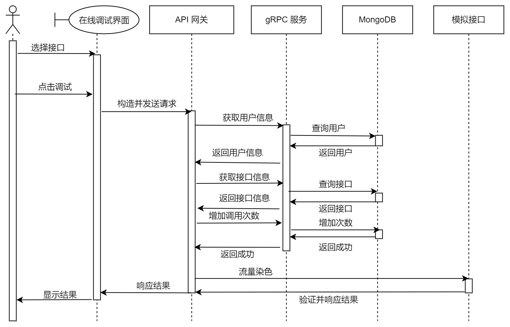
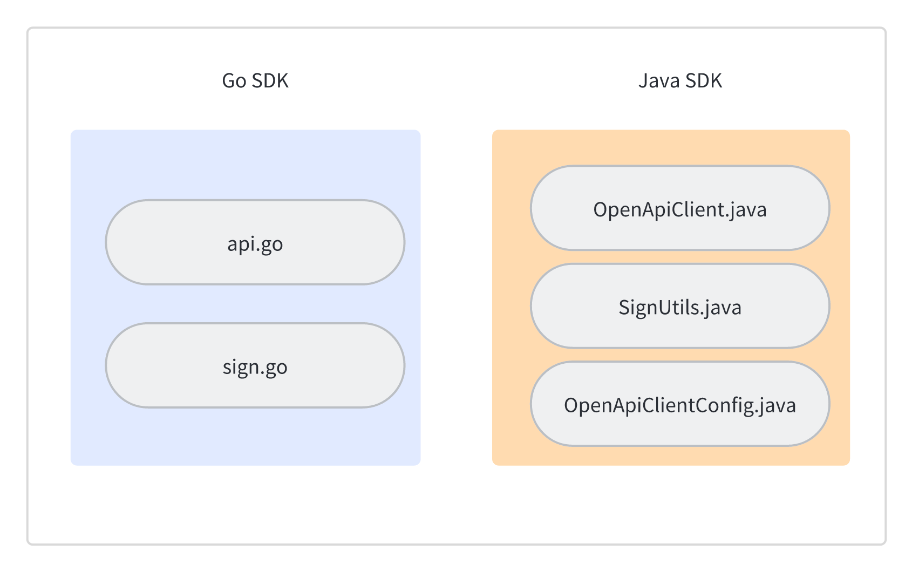

# Open-Api - API 开放平台
## 项目介绍
API 开放平台是一个为开发者提供接口和工具的平台，使他们能够构建基于平台的应用程序和服务。

平台为开发者用户提供了接口文档查阅和在线调试功能，另外还可以下载 SDK，便于开发者接入。而管理者可以开发并创建接口，对接口进行上线、下线、修改、删除等操作，并可以按条件进行查询。另外管理人员还可以进行统计分析，查看接口调用情况。 

| 子项目              | 描述                              | 目录          |
| ------------------- | --------------------------------- | ------------- |
| API 网关            | 拦截 API 访问请求，做统一业务处理 | [api-gateway](https://github.com/jianping5/open-api/tree/main/api-gateway)   |
| 模拟接口            | 平台提供的 API                    | [api-interface](https://github.com/jianping5/open-api/tree/main/api-interface) |
| 用户前台+管理员后台 | 平台主要业务                      | [api-main](https://github.com/jianping5/open-api/tree/main/api-main)      |


## 应用场景
常用于企业将自己的核心功能以 API 形式对外提供。

## 功能大全
项目结构图



（1）开发者




（2）管理员



## 系统架构


## 业务流程


## 技术栈
### 前端
主要技术
- React 18
- Umi 4.x
- Ant Design 4.x 组件库
- Ant Design Pro Components 高级组件
- TypeScript 类型控制
- Eslint 代码规范控制
- Prettier 美化代码

### 后端
主要技术
- Go 1.19
- Gin 1.9.x
- grpc-go 1.56.x
- MongoDB
- mongo-go-driver 1.11.x

## 运行设计


## API 签名认证


## SDK 设计


- [Go SDK](https://github.com/jianping5/open-api-sdk-go)
- [Java SDK](https://github.com/jianping5/open-api-sdk-java)

## 数据库设计
（1）用户表
```Go
type User struct {
    Id           primitive.ObjectID `bson:"_id,omitempty"`
    UserAccount  string  `bson:"user_account,omitempty"`
    UserRole     string  `bson:"user_role,omitempty"`
    UserPassword string  `bson:"user_password,omitempty"`
    AccessKey    string  `bson:"access_key,omitempty"`
    SecretKey    string  `bson:"secret_key,omitempty"`
    IsDelete     int8    `bson:"is_delete"`
}
```
（2）接口信息表
```Go
type InterfaceInfo struct {
    Id             primitive.ObjectID `bson:"_id,omitempty"`
    UserId         primitive.ObjectID `bson:"user_id"`
    Name           string             `bson:"name,omitempty"`
    Description    string             `bson:"description,omitempty"`
    Url            string             `bson:"url,omitempty"`
    RequestParams  string             `bson:"request_params"`
    RequestHeader  string             `bson:"request_header,omitempty"`
    ResponseHeader string             `bson:"response_header,omitempty"`
    Status         int8               `bson:"status"`
    Method         string             `bson:"method,omitempty"`
    IsDelete       int8               `bson:"is_delete"`
}
```
（3）用户接口关系表
```Go
type UserInterfaceInfo struct {
    Id              primitive.ObjectID  `bson:"_id,omitempty"`
    UserId          primitive.ObjectID  `bson:"user_id,omitempty"`
    InterfaceInfoId primitive.ObjectID  `bson:"interface_info_id,omitempty"`
    TotalNum        uint                `bson:"total_num"`
    LeftNum         uint                `bson:"left_num"`
}
```